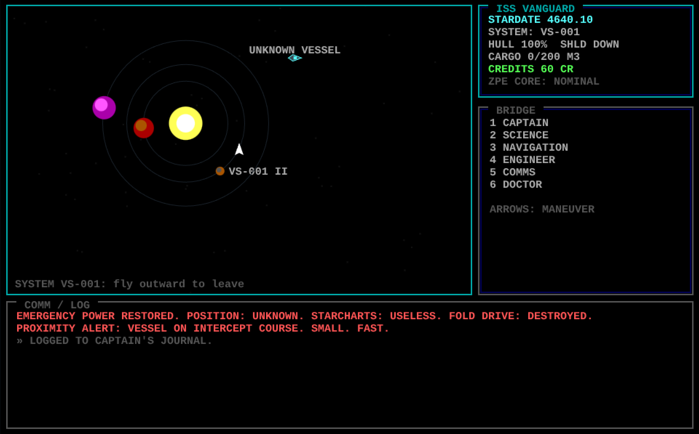
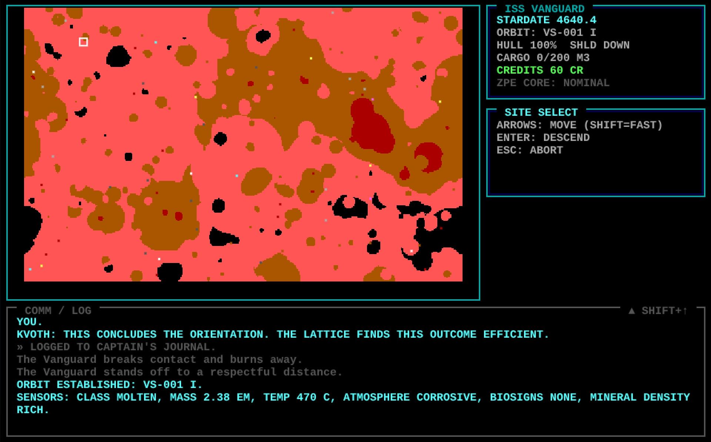
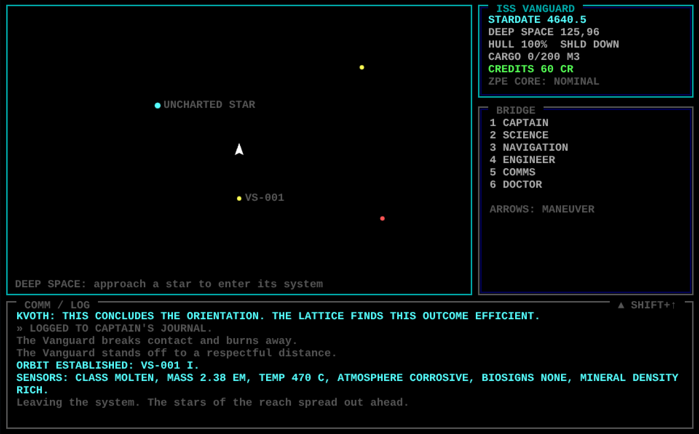

# STARFOLD: The Voyage of the ISS Vanguard

**▶ Play it now: <https://starfold.eu>** — free, in your browser, nothing to install.

An ode to the 1986 classic
<a href="https://en.wikipedia.org/wiki/Starflight" target="_blank"><strong>Starflight</strong></a>,
created by **Binary Systems**, the five-man team of Rod McConnell, Greg
Johnson, Alec Kercso, Tim C. Lee, and Bob Gonsalves, and published by
Electronic Arts. A complete retro space exploration RPG in pure
HTML5/JavaScript: **no dependencies, no build step, no server**. One canvas,
sixteen colors, keyboard only.

Explore a procedurally generated sector, mine planets with a terrain vehicle,
trade with alien cultures that each respect a different tone of voice, chase
rumors through station lounges and ancient ruins, and find out why the stars
are going dark.

## The situation

Twenty years have passed since the Heroes of Arth set forth to save the
galaxy by bringing about the destruction of the Crystal Planet. From the
long shadow of the Old Empire a New Empire has been reformed, and its
brightest minds have conceived a technological marvel the likes of which
the universe has never seen: the **Fold Drive**, a device that folds two
points of space together and steps across.

The **ISS Vanguard**, making its maiden voyage, had barely engaged
the drive when a catastrophic malfunction dumped an impossible surge of
power into it. When the lights came back on, the
crew was somewhere no chart recognizes, the Fold Drive was slag, and something
small, fast, and exact was already on an intercept course.

The zero-point engines need no fuel. Everything else must be earned.

Find out where you are. Survive it. Find a way home.

## Play it

Play in your browser at <https://starfold.eu> — nothing to install.

Prefer to run it locally? Clone or download this repository and open
`index.html` in any modern browser. That's it.

Progress autosaves at key moments (docking, orbit, quest beats) to browser
localStorage; use **CAPTAIN > SAVE GAME** any time and **CONTINUE** on the
title screen to resume.

## Features

- A full campaign: first contact, factions, artifacts, and an ending shaped
  by how you played
- Deterministic procedural galaxy: hundreds of stars and planets, identical
  for every player, so coordinates in rumors actually mean something
- Orbit-to-surface gameplay: sensor sweeps, landing sites, terrain-vehicle
  mining and xenobiology
- Ship management: six officers, upgrades, armor that regrows from cargo
  metals, a repair droid with priorities of his own
- WebAudio bleeps and a CRT-era aesthetic, faithful to the EGA originals

  
  

## Controls

| Key | Context | Action |
|-----|---------|--------|
| Arrow keys | flight / surface | maneuver ship / drive terrain vehicle |
| 1–6 | flight | officer stations: Captain, Science, Navigation, Engineer, Comms, Doctor |
| Enter | menus / surface | select / interact (mine, recover, scan) |
| Esc | anywhere | back / menu |

## The crew

- **CAPTAIN**: that's you. Log, cargo, jettison, fold drive, save, and the red button
- **SCIENCE**: sensors, artifact analysis, starmap. Scan everything. *Everything.*
- **NAVIGATION**: orbit, TV deployment, docking, shields
- **ENGINEER**: continuous field repairs (armor regrowth consumes titanium from cargo)
- **COMMS**: hailing. Choose your posture before you speak; different cultures respect different tones
- **DOCTOR**: keep the crew breathing

## Stuck?

`SPOILERS.html` is the hint book and full design document — a self-contained
page where each hint and answer stays hidden behind a button until you click
it, so you can reveal only what you need. Open it in any browser. Part II lays
out every mechanic and spoils *everything*. You have been duly warned.

## Author & license

**Florian Köllich** <florian@koellich.com>

Free software under the **GNU General Public License v3**, see
[LICENSE](LICENSE). Play: <https://starfold.eu> ·
Source: <https://github.com/koellich/starfold>

---

*Fan homage, not affiliated with or endorsed by Electronic Arts or the
members of Binary Systems. Starflight and all other trademarks are the
property of their respective owners.*
